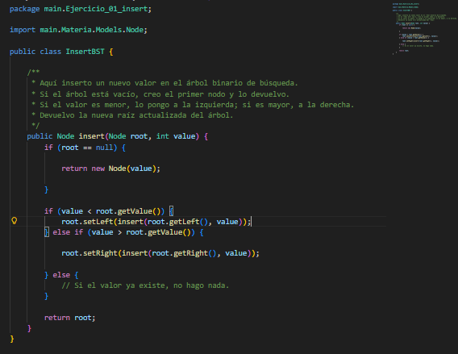

# Estructuras No Lineales – Ejercicios Árboles  
**Autor:** *Antonio Andres Carvelli Perez*  
**Materia:** Estructuras de datos Lineales  

---

## 🧩 Introducción

En este proyecto desarrollé cuatro ejercicios prácticos enfocados en estructuras no lineales, específicamente **árboles binarios** como se le solicitaba en la Practica DeLaboratorio 3 en el Avac. 

Mi objetivo fue comprender la representación, recorrido, manipulación e interpretación de estas estructuras, aplicando lógica recursiva, métodos iterativos y principios de programación orientada a objetos.  

Cada ejercicio lo organicé dentro de su propia carpeta para mantener una estructura limpia y modular, respetando la convención de paquetes en Java y los estándares que se evaluarán en GitHub Actions.

---

Cada carpeta contiene la clase principal y su respectiva prueba unitaria, lo que me permitió validar el funcionamiento de cada algoritmo de forma independiente.

---

## 🌱 Ejercicio 01 – Inserción en un Árbol Binario de Búsqueda (BST)

**Clase:** `InsertBST.java`  

**Captura del código:**  
👉 

### 🔍 Explicación de la lógica

En este ejercicio implementé un algoritmo recursivo para construir un **árbol binario de búsqueda** (BST).  
La idea principal es mantener el orden lógico del árbol: los valores menores que el nodo actual se colocan a la izquierda y los mayores a la derecha.

1. Si el árbol está vacío, creo un nuevo nodo raíz.  
2. Si el valor a insertar es menor que el nodo actual, llamo recursivamente al método para el subárbol izquierdo.  
3. Si es mayor, lo inserto en el subárbol derecho.  
4. Si el valor ya existe, no lo vuelvo a insertar para evitar duplicados.

El proceso termina cuando se han colocado todos los valores en sus posiciones correspondientes, respetando las reglas del BST.

**Ejemplo:**
